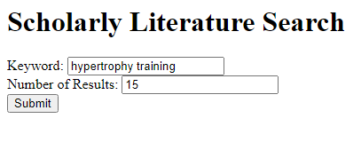
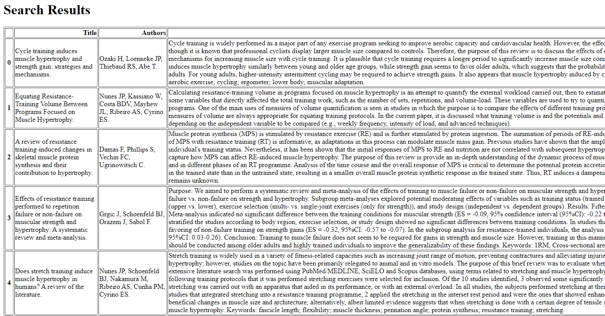
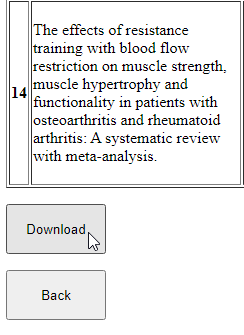
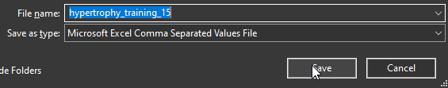

# Scholarly Literature Search 1.1 implemented with Flask
Refactored to run a bit faster, but it seems to still be dreadfully slow at times. Currently working on incorporating multiprocessing to speed up the web scraping. Alternatively looking into refactoring with the intent to send and receive JSON data rather than use BS4, though I'm not sure if the study abstracts in their entirety can be accessed that way.
## How to use:

### Live site:
https://scholarly-literature-search.azurewebsites.net/

### Localized instance:
Ensure all requirements are met and use a cli to enter "flask run" in the directory (ctrl+c to end session when done)

### API call:
| Path      | Methods | Parameters     | Description | 
| ---- | ---- | ---- | ---- |
| /api/submit     | POST       | keyword: string, results num: int > 0  | Takes keyword and results num input and returns a JSONified data table |

App can then be accessed locally via http://127.0.0.1:5000/
## Screenshots

 

 

 

