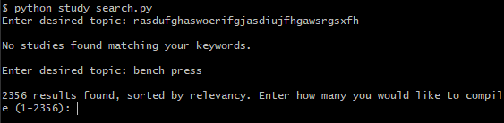
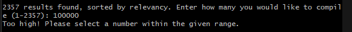
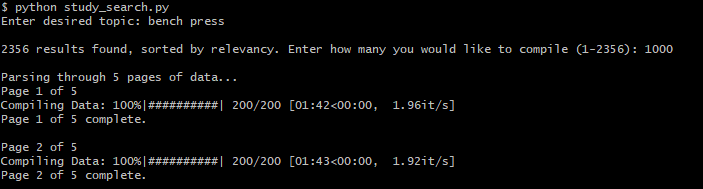
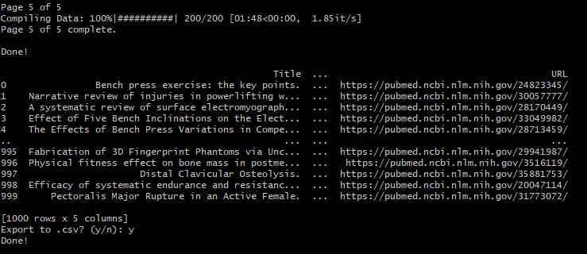
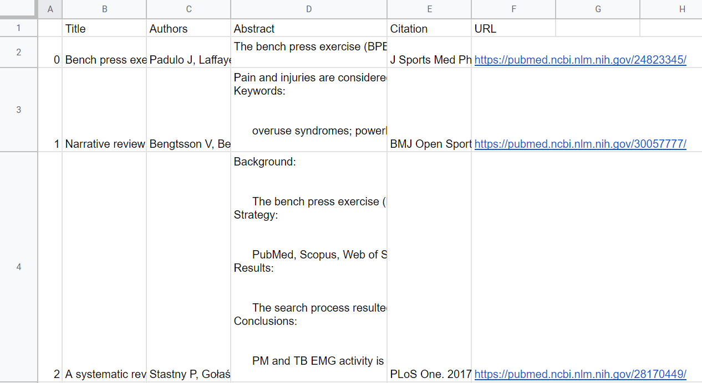
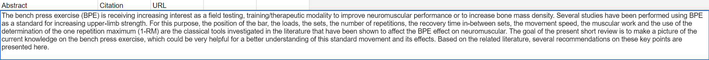

# Scholarly Literature Search
### Code is written and executed in [study_search.py](scholarly_literature_search/study_search.py)

## Introduction:

This app is a web scraping utility which, when given a keyword, collects data from PubMed and compiles it into a table, displays a preview of the table, and allows the user to export the data to a .csv file.

## Design and Implementation:

I began this project by doing a bit of research into what tools and libraries would be necessary to perform specific tasks such as grabbing web data, parsing through html code, and arranging it all neatly. For the web side of things, I ended up going with Requests (sends http requests) and BeautifulSoup (parses through html data). I felt that these were best for my project, as they’re relatively straightforward and my overall goal was pretty simple. As for sorting and arranging the data, I had some familiarity with the Pandas library already, so I went with that. I also ended up using a library called tqdm, which acts as a loading bar while the program is operating.

When the program starts, you are greeted with an input prompt for a search term (or alternatively you can specify the keyword upon creating a new object). The program will fetch the total number of results that stem from your search or loop back to the initial input if no results are found.

You can then choose how many results you would like to have entered into the data table, with an error message appearing if you select more than the max result value. A similar error message is shown if you happen to pick a number less than one, as well.

After selecting the number of desired results (1000 in this case), the program will begin to compile everything into a table. The information collected includes the title, authors, abstract, citation, and study URL. The operation is separated into 200-item chunks while everything is being processed, as the maximum displayable results on PubMed is 200. Additionally, the loading bar on the program displays some metrics such as percentage, total time, time per action, and page position.

Earlier on, I found a couple of bugs in my code that manifested during this stage, all of which had to do with HTML formatting. When conducting large-scale collection, the page data of certain studies ended up deviating from what I had previously established as the norm; the program would fail as it searched for an HTML section that didn’t exist on the page. I ended up rewriting that portion of the code and was able to have it run without error. 

As the program finishes up collecting all of the data, a preview is printed out on the console alongside a prompt to export the data to a .csv file. If you decide you want to keep the data, a file is created using the query and total number of results as a naming convention (e.g. bench_press_1000.csv). A sample of the final file is shown below. All of the information is present, and can be fully accessed by highlighting the given cell.

## Conclusions:

I feel as though I learned a lot from this project, and I am glad I chose it! I ran into several issues along the way and was able to navigate through them and gain experience each time. One of the biggest lessons I encountered was that not every site allows for web scraping to take place. I initially settled on the National Library of Medicine as the source for data collection, and I spent about an hour trying to troubleshoot my code until I realized its operations were being denied by the website. I became discouraged initially, but ended up trying PubMed instead and was able to get everything to run correctly.

In the future, I would like to further optimize my code by improving the speed at which data is collected as well as how some of the text is formatted. For whatever reason, even after using string methods such as .strip() to remove whitespaces, they are still present to some degree in the abstract. Additionally, certain abstracts begin with the authors and citation information. It would be nice to clean that up and remove any duplicates to improve readability. I think I’ll try and tackle these issues on the side as we continue to progress through the rest of the bootcamp. 
Overall, I think this program has some genuine utility for students in the case of quickly finding relevant studies to cite for an essay or project. It was very reaffirming to come up with a practical idea and bring it to life through code.

