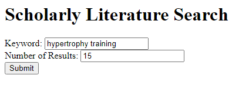
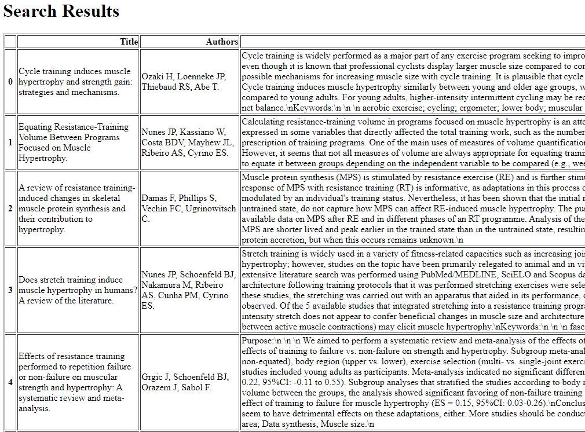
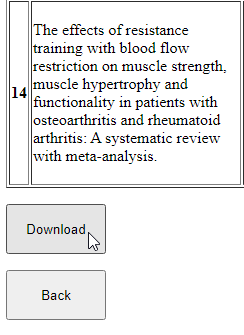
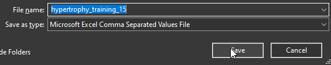

# Scholarly Literature Search 1.1 implemented with Flask
Refactored to run a bit faster, but it seems to still be dreadfully slow at times. Currently working on incorporating multiprocessing to speed up the web scraping. Alternatively looking into refactoring with the intent to make retrieve JSON data rather than use BS4.
## How to use:
Ensure all requirements are met and use a cli to enter "flask run" in the directory (ctrl+c to end session when done)

App can then be accessed locally via http://127.0.0.1:5000/
## Screenshots

 

 

 

